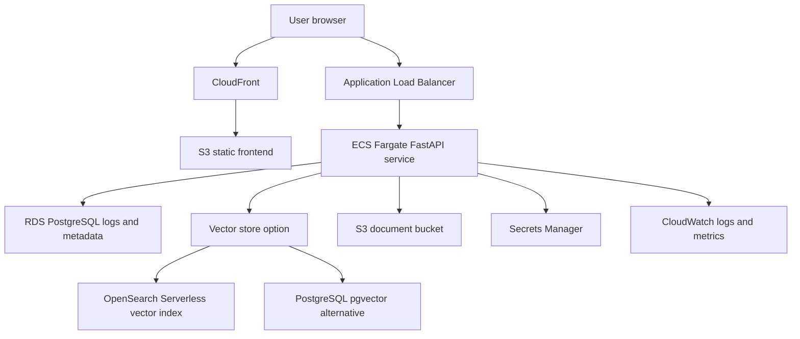

# AWS Architecture Draft

## Purpose

This document describes a practical AWS production direction for SupportFlow RAG. The current portfolio implementation is intended to run locally with Docker Compose; this AWS design is a deployable reference architecture, not a claim that the demo is already hosted on AWS.

## Proposed Architecture

## Component Mapping

| Local Portfolio Component | AWS Production Option | Notes |
| --- | --- | --- |
| React/Vite frontend | S3 + CloudFront | Static hosting with cache invalidation on release. |
| FastAPI backend | ECS Fargate behind ALB | Predictable container runtime and simple scaling. |
| Local retrieval index | OpenSearch Serverless or PostgreSQL pgvector | The portfolio keeps local search lightweight; production should use managed persistence and embedding search. |
| SQLite logs | RDS PostgreSQL | Durable query logs, evaluations, and document metadata. |
| sample_docs folder | S3 document bucket | Versioned source documents and ingestion events. |
| OpenRouter/Ollama settings | Secrets Manager and Parameter Store | Keep provider keys and model configuration out of code. |
| Local logs | CloudWatch | Centralized logs, metrics, and alarms. |

## Request Flow

1. User opens the frontend from CloudFront.
2. The frontend sends an ask request to the FastAPI service through the ALB.
3. FastAPI logs the question metadata.
4. Retrieval runs against the managed vector store and keyword index.
5. FastAPI calls the selected LLM provider.
6. The answer, sources, retrieval scores, and latency are returned to the frontend.
7. Query, retrieval, and answer metadata are saved to PostgreSQL.

## Ingestion Flow

1. Administrator uploads source documents to S3 or commits sample documents to the repository.
2. Ingestion job extracts text and metadata.
3. Chunks are embedded and written to the vector store.
4. Document status is recorded in PostgreSQL.
5. Reindex completion metrics are emitted to CloudWatch.

## Security

- Store API keys and webhook secrets in Secrets Manager.
- Give the ECS task role least-privilege access to S3, Secrets Manager, logs, and the vector store.
- Keep the public frontend static; route all provider calls through the backend.
- Enable TLS at CloudFront and the ALB.
- Redact token-like strings in logs and exports.
- Restrict admin ingestion and evaluation actions behind authentication in a production version.

## Reliability

- Run at least two Fargate tasks across availability zones for production.
- Use RDS automated backups and point-in-time recovery.
- Store source documents in versioned S3 buckets.
- Make ingestion idempotent by source path and source ID.
- Keep old vector indexes until a replacement index passes smoke checks.

## Observability

Recommended CloudWatch metrics:

- Ask request count and error count.
- P50 and P95 answer latency.
- Retrieval hit rate.
- Average citation count.
- LLM provider error rate.
- Document ingestion failures.
- Evaluation recall and keyword-match trends.

## Cost Controls

For a portfolio or interview demo, keep the RAG app local and publish only the static explanation page. For a production deployment, use scheduled scaling, small Fargate task sizes, S3 lifecycle policies, and explicit LLM provider budgets.

## Deferred Production Work

- Authentication and tenant isolation.
- CI/CD pipeline with migrations.
- Managed reranker.
- Secrets rotation automation.
- Multi-region failover.
- Full PDF/DOCX extraction pipeline with malware scanning.
