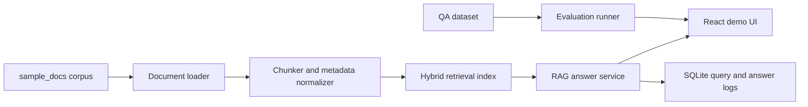

# SupportFlow RAG Design

## Summary

SupportFlow RAG is a portfolio implementation of an inquiry-management SaaS knowledge assistant. It ingests internal SupportFlow operations documents, retrieves relevant sources with hybrid search, and generates grounded answers for support agents and administrators.

The demo is designed to run locally through Docker Compose. The portfolio should show the full RAG lifecycle: document ingestion, chunking, indexing, retrieval, answer generation, source display, logging, and evaluation.

## Product Context

SupportFlow is a fictional B2B SaaS used by support teams to manage customer inquiries. The knowledge base covers:

- User manuals
- FAQ
- Incident response runbooks
- API specifications
- Release notes
- Test specifications
- Support response templates
- Operations rules

The corpus intentionally avoids unrelated business topics and focuses on support operations, queue routing, API behavior, incident handling, and evaluation.

## Goals

- Answer SupportFlow operational questions with cited sources.
- Show retrieved source snippets, scores, and document metadata.
- Support simple lookup, multi-document synthesis, named API/error-code questions, vague user wording, and unanswerable questions.
- Let users inspect indexed documents and run evaluation cases from a local admin screen.
- Keep the system understandable enough for a portfolio interview walkthrough.

## Non-Goals

- Production customer deployment.
- Always-on hosted LLM API service.
- Authentication beyond demo-safe local access.
- Full enterprise-grade binary ingestion for arbitrary PDF and DOCX uploads. The sample corpus includes lightweight PDF/DOCX files and text sidecars for deterministic review.
- A full reranker, fine-tuned model, or enterprise observability stack.

## Architecture

## Backend Responsibilities

The FastAPI backend should own ingestion, retrieval, answer generation, logs, and evaluation APIs.

Expected modules:

- Document loading for Markdown, TXT, CSV, JSON, PDF, and DOCX sources.
- Chunking with source path, category, title, source ID, and section metadata.
- Retrieval behind a vector-store-ready interface. The local demo uses deterministic scoring to avoid model/API costs; production can swap in Chroma, OpenSearch, or pgvector.
- Keyword retrieval for exact terms such as `AUTH_401`, `RATE_429`, `message.created`, and endpoint paths.
- Hybrid result merge and score normalization.
- Prompt construction with retrieved context.
- Grounded answer generation through OpenRouter or a local Ollama model.
- Unanswerable detection when retrieved evidence is weak or missing.
- SQLite logging for questions, retrieved sources, provider selection, latency, and evaluation outcomes.

## Retrieval Design

Hybrid retrieval is important because the corpus mixes prose, tables, JSON, CSV, endpoint names, and error codes. Semantic retrieval should handle vague questions like "the API is throttling us." Keyword retrieval should preserve exact named entities like `WEBHOOK_SIG_INVALID`.

Recommended retrieval flow:

1. Normalize the user query.
2. Run retrieval through the search-index abstraction.
3. Run keyword search over chunk text and metadata.
4. Merge results by source ID and chunk ID.
5. Prefer exact named-entity matches for API codes, endpoint paths, webhook event names, and role names.
6. Pass the top sources into the answer prompt with citation labels.
7. Decline or ask for clarification when evidence is insufficient.

## Prompt Contract

The answer prompt should require:

- Use only provided context.
- Cite source filenames.
- Distinguish confirmed facts from unknowns.
- For missing facts, say the documents do not state the answer.
- Do not expose or invent secrets.
- Keep agent-facing answers concise and operational.

## Frontend Surfaces

The planned UI uses four tabs:

- Ask: question input, grounded answer, citations, retrieval scores, provider status.
- Documents: corpus list, upload/import status, reindex action, document metadata.
- Evaluation: benchmark summary, failing questions, keyword match rates, source recall.
- Logs: recent questions, provider, retrieval mode, latency, status, and citation count.

## Data Model Notes

Every indexed chunk should retain:

- Source path
- Category
- File type
- Source ID
- Title when available
- Chunk index
- Character offsets or approximate section label
- Last indexed timestamp

This metadata is necessary for source display, evaluation scoring, and debugging retrieval misses.

## Quality Bar

A successful demo should show:

- Correct answer with sources for simple lookup questions.
- Correct synthesis for questions that require multiple documents.
- Exact matching for API error codes and webhook event names.
- Explicit refusal for missing facts such as secret values or unsupported metrics.
- A visible evaluation report with failures and improvement notes.
